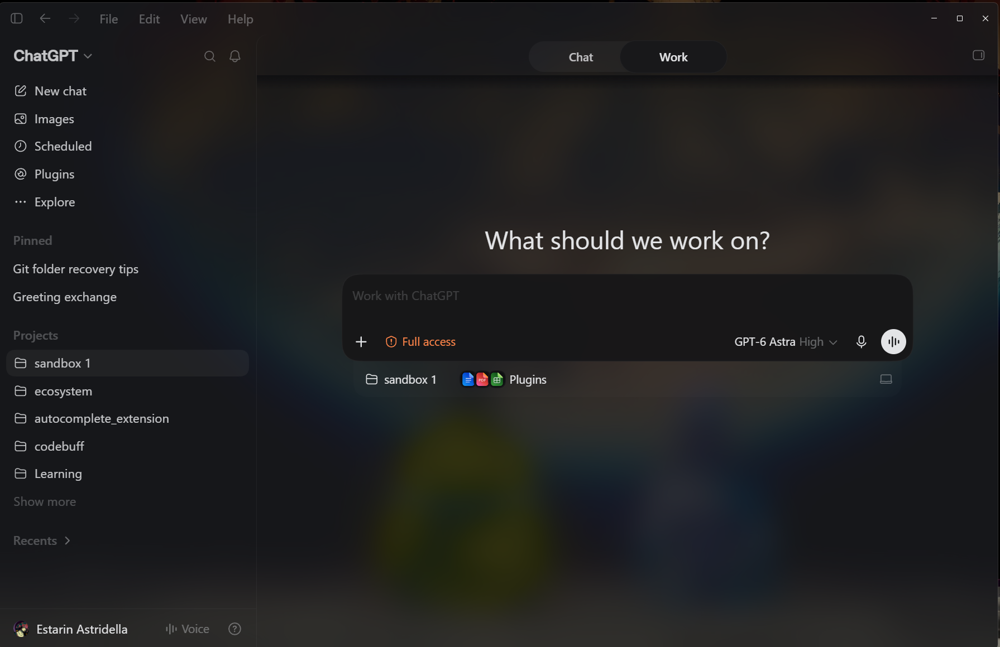
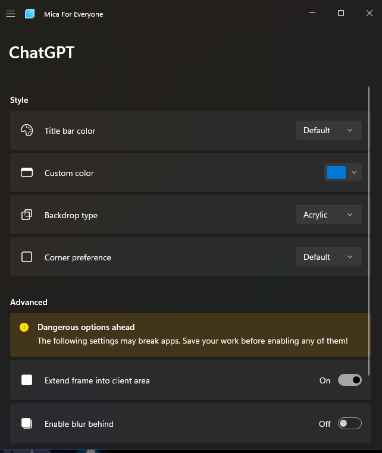

# ChatGPT desktop: smoked-glass Acrylic patch



> [!IMPORTANT]
> **Mica For Everyone is required for this documented setup. Install it and keep it running whenever you use the patched app.** The patch files and `gpt` launcher do not install or start it for you. Install it from the [Microsoft Store](https://apps.microsoft.com/detail/9p8v68p4z78p?hl=en-US&gl=NZ), or visit the [official Mica For Everyone project](https://github.com/MicaForEveryone/MicaForEveryone), then follow the [configuration steps below](#3-configure-mica-for-everyone): **Acrylic**, **Extend frame into client area on**, and **Blur Behind off**.

## Get started

1. [Download this repository as a ZIP](https://github.com/EstarinAzx/ChatGPT-Acrylic-Patch/archive/refs/heads/main.zip), or clone it.
2. Extract it and open the folder in your local coding agent.
3. Paste the [agent prompt below](#paste-this-into-your-agent). The agent must check your installed build before patching.

Give this folder to an agent with local Windows file and terminal access, then paste the prompt below. The agent can inspect your installation, prepare an editable copy, apply the compatible patch, and verify it. A normal web chat without local tools cannot perform the installation.

This is a community modification of one tested Windows build, not an official app setting or a universal installer. It creates blurred glass behind the app with one charcoal backing: `rgba(8, 10, 14, 0.70)`. Window/body opacity stays unchanged, and the Thinking/status shimmer uses a brighter grey base with a pale sweep. The 70% value describes the CSS backing, not overall window opacity or a native Acrylic tint control.

## What to give your agent

Extract the whole ZIP into a writable folder and open it in your agent. Keep the supplied files together:

- `README.md` — this guide, including installation and rollback.
- `patches/chatgpt-acrylic.py` and `.css` — guarded archive patch and appearance.
- `checks/chatgpt-native-material.cjs` — verifies the app's native-material selection and fallback behavior.
- `checks/chatgpt-acrylic.py` — checks Mica For Everyone configuration and the running editable window.
- `Launch-ChatGPT-Acrylic.ps1` — launches the copy with a separate profile.

The app itself, accounts, profiles and Mica For Everyone settings are not included. The supplied scripts are reference copies from the tested installation; their target paths must be adapted as described below.

## Paste this into your agent

> Apply the smoked-glass Acrylic appearance described in the attached README.md using its supplied patch, CSS, checks and launcher. Read the guide and scripts first. Treat Mica For Everyone as a prerequisite: verify it is installed, running, and configured with the documented ChatGPT rule before calling the setup complete; if it is missing, help me install it from the official project. Discover my actual Windows/app/Mica For Everyone installation and check the supported archive hash before making changes. Prepare a separate writable app copy with an isolated profile, adapt only the machine-specific paths, back up the relevant configuration, and apply the supported patch. Preserve my Store installation, existing profiles, security settings and unrelated Mica For Everyone rules. If the build or runtime differs, report the mismatch and stop before patching; do not weaken the guards. Run the supplied checks, create a desktop shortcut, and set up a PowerShell `gpt` command for the patched copy using the instructions below. Preserve any existing command with that name. Give me rollback instructions and a short visual checklist for restored and truly maximized windows. Ask me only for necessary human steps or decisions.

## Compatibility gate

The recorded successful installation on 15 September 2026, with the Thinking-text contrast update accepted on 16 September, was:

| Item | Tested value |
| --- | --- |
| Windows | Windows 11, build 26200 |
| Store package | `OpenAI.Codex_26.908.4834.0_x64__2p2nqsd0c76g0` |
| Executable/window name | `ChatGPT.exe` / `ChatGPT` |
| Internal app version | `26.908.40834` |
| Runtime | Owl / Chromium `152.0.7977.83` |
| Pristine `app.asar` SHA-256 | `2bd5b96a48232f3ccf3df6be50965920699ea3a1b4512dcdd770e209fd1f009e` |

**Check the package and archive, not just the displayed app name.** Despite the ChatGPT executable name, this tested package is named OpenAI.Codex. Compatibility with other ChatGPT packages, releases, macOS or Windows builds has not been established.

An agent can discover likely packages with `Get-AppxPackage *OpenAI*` and calculate the archive hash with `Get-FileHash -Algorithm SHA256 -LiteralPath '<actual app.asar path>'`. Inspect the package's layout to locate the executable and its resources. Do not assume the package root is the executable directory.

An unknown hash is a stop condition. Updating `SOURCE_SHA256` to whatever is installed defeats the compatibility check. A different build needs a separately reviewed port, including its actual renderer selectors, native-material branch, archive integrity format and checks.

## Agent installation procedure

### 1. Inspect prerequisites and prepare the copy

1. Verify the compatibility gate and availability of Python 3, Node.js and PowerShell. The supplied Python and Node checks use standard libraries; no package installation is needed for them.
2. Locate Mica For Everyone (MFE). If absent, obtain it through its [official project distribution](https://github.com/MicaForEveryone/MicaForEveryone), reviewing the current installation instructions. Discover its actual config location and version; this guide's recorded installation used the packaged JSON format. Verify Windows transparency effects are enabled; if a change is needed, explain it to the user.
3. Choose a new writable directory, for example `%LOCALAPPDATA%\ChatGPT-Acrylic`. Use an empty destination or inspect an existing copy before reusing it.
4. Copy the complete installed application directory containing `ChatGPT.exe`, including its resources, runtime files and unpacked assets, into `<copy-root>\app`. Preserve the original installation. If access is denied, report that boundary; do not take ownership of WindowsApps or weaken its permissions.
5. Verify the copied `app\resources\app.asar` still has the pristine supported hash. Put the supplied launcher at `<copy-root>\Launch-ChatGPT-Acrylic.ps1`.

### 2. Adapt the reference paths

Make these edits in the extracted patch bundle, before running it:

| File | Required adaptation |
| --- | --- |
| `patches/chatgpt-acrylic.py` | Set `TARGET` to the absolute `<copy-root>\app\resources\app.asar` path. `BACKUP` is derived automatically. |
| `checks/chatgpt-acrylic.py` | Set `target` to the absolute `<copy-root>\app\ChatGPT.exe` path. Verify/adapt `settings` to the real MFE config path. |
| `checks/chatgpt-native-material.cjs` | Leave unchanged; pass the actual archive path as its command-line argument. |
| `Launch-ChatGPT-Acrylic.ps1` | Leave unchanged when it sits next to the `app` directory; it uses its own directory to locate the app and profile. |

Keep the hash checks, native replacement assertion, integrity updates and local-edit refusal intact. Run Python normally, without `-O`, because the supplied safety and verification checks use assertions. Use a real directory rather than a redirected/junction target.

The launcher sets `CODEX_ELECTRON_USER_DATA_PATH` only for its child process and passes `--user-data-dir`, both pointing at `<copy-root>\test-profile`. This is the tested profile-isolation mechanism for this build. Preserve the normal app's profile and `CODEX_HOME`. The user may need to sign in manually in the separate copy; do not copy tokens or credentials.

### 3. Configure Mica For Everyone

Back up the existing configuration before changing it. Add or update the process rule for **ChatGPT**, preserving all unrelated settings:

| Setting | Value |
| --- | --- |
| Backdrop | Acrylic |
| Extend frame into client area | On |
| Blur Behind | **Off** |

Match these settings in the **ChatGPT** rule:



In the tested JSON format these correspond to `backdropPreference: "Acrylic"`, `extendFrameIntoClientArea: true`, and `enableBlurBehind: false`, on a `type: "process"`, `processName: "ChatGPT"` rule. Ensure one effective matching rule and inspect any competing rules. Prefer MFE's own settings interface; if editing its file, ensure the running app will not overwrite the edit and reload it appropriately.

**The process rule applies to both executable copies named ChatGPT.** The archive patch affects only the editable copy, but the MFE appearance rule can affect the Store app too. Explain that scope before applying it.

Keep MFE running, then create fresh app windows. Turning off Blur Behind matters: its extra effects caused maximized darkening in the tested Owl runtime. Use native Acrylic together with this setting. A CSS-only patch or a material-only change is not the complete verified fix. No resizing helper, fake maximization or persistent enforcement daemon is needed.

### 4. Apply and launch

Close only the editable app copy, matching its executable path; preserve unrelated app sessions. From the extracted bundle directory, run:

```powershell
python patches/chatgpt-acrylic.py
python patches/chatgpt-acrylic.py --check
```

The patcher saves `app.asar.before-acrylic.bak` next to the archive, appends the CSS, and changes the supported transparent Windows material branch from Mica to Acrylic. It updates the changed assets' SHA-256 integrity metadata and retains unrelated entries and original payload bytes. It refuses unexpected builds and local edits.

Launch through `<copy-root>\Launch-ChatGPT-Acrylic.ps1`, using a hidden PowerShell window for the launcher. Respect the machine's execution policy; do not bypass or change it. If policy prevents launch, report the restriction and agree on an allowed launch method.

Create a clearly labelled shortcut, such as **ChatGPT Acrylic**, to this launcher. Normal Store shortcuts still launch the original installation.

#### Everyday launch: `gpt`

After your agent sets it up, open PowerShell and type:

```powershell
gpt
```

This opens the patched copy with its separate profile and returns the terminal prompt immediately. Mica For Everyone must also be running for the documented setup.

**Agent setup:** create a small `gpt.ps1` wrapper that starts `Launch-ChatGPT-Acrylic.ps1` through Windows PowerShell in a hidden window, using `Start-Process` without waiting. Point it at the recipient's actual launcher path; keep profile handling in the supplied launcher. The wrapper is generated locally because its install path varies by machine; it is not included as a preconfigured file in this repo.

1. Check `Get-Command gpt -All -ErrorAction SilentlyContinue` and inspect any existing wrapper before writing. Preserve an unrelated command; use an agreed alternative such as `gpt-acrylic` if the name is taken.
2. Prefer an existing user-owned bin directory already on PATH. On the original machine this was `%USERPROFILE%\.local\bin\gpt.ps1`; that directory is not guaranteed to exist or be on PATH elsewhere. If no suitable directory exists, explain the required user PATH change and obtain approval, or keep the desktop shortcut as the launch method. Preserve shell profiles and execution policy.
3. Verify `Get-Command gpt` resolves to the intended wrapper, run it from PowerShell, and confirm the launched executable belongs to the editable copy. If user PATH was changed, use a fresh terminal for verification.

When reporting completion, tell the user the actual command name and shortcut location. For removal, delete only the wrapper created for this setup and undo only a PATH addition made for it, if that directory is no longer needed.

### 5. Verify before calling it finished

With the editable app open and not minimized, run from the bundle directory:

```powershell
python patches/chatgpt-acrylic.py --check
node checks/chatgpt-native-material.cjs '<copy-root>\app\resources\app.asar'
python checks/chatgpt-acrylic.py
```

Replace `<copy-root>` with the actual absolute path. The three checks respectively verify archive equality/preservation, packaged material-selection behavior, and MFE configuration plus native Acrylic value `3` on the matching executable's visible ChatGPT window. The desktop check does not prove every window is covered or that the visible pixels look correct.

Have the user check the real app over a colourful background:

- Blur is visible through the title bar, main area and sidebar; the backing looks like one continuous charcoal layer.
- Text and controls stay readable. During a response, the Thinking/status label stays visible through its pale shimmer. Settings opens normally with the same backing.
- Restored and **truly maximized** windows both retain the expected glass appearance. Also check restore after maximizing and minimize/restore.
- Normal app interactions still work. Record any opaque fallback instead of forcing transparency through it.

Use user visual confirmation where the agent's tools cannot inspect or control the real app. A passing native attribute check alone is not proof of visible blur.

## Tuning the darkness

The supplied CSS uses one `rgba(8, 10, 14, 0.70)` backing. Increasing the last number makes it darker/more opaque; decreasing it reveals more background. Avoid setting opacity on the entire window or body, which also fades text and controls.

**Roll back before editing the CSS or patch algorithm.** The patcher uses the current source files to recognize the installed patched archive, so changing them first can trigger its local-edit refusal.

1. Close the editable copy.
2. Run `python patches/chatgpt-acrylic.py --rollback` with the currently installed patch sources.
3. Edit the CSS backing value, retaining its scoped selectors.
4. Run the patcher again, relaunch and repeat verification.

The approved 70% appearance was visually accepted on the original machine. Native maximization had been confirmed for the combined fix earlier; it was not visually retested after the final CSS-only tint adjustment. Treat another machine's visual checklist as required verification, not an assumed result.

## Thinking text contrast

The CSS gives the cadenced Thinking/status shimmer a base of `oklch(78% 0.01 260)` and a highlight of `oklch(93% 0.005 260)`. The original dark-mode style was faint with a black sweep. These overrides preserve the animation and reduced-motion behavior, and apply only inside the transparent main surface. The 70% backing is unchanged.

This appearance was accepted on the tested machine. Browser computed-style checks verified the colors, unchanged body tint/opacity and exclusion of opaque mode and non-main surfaces. The selector includes a build-specific CSS class, so a future app port must inspect it again.

## Updating an existing patch on the same app build

**Keep the old patch sources until rollback is complete.** This applies to downloading a newer patch bundle or pulling this repository, including the Thinking-text update.

1. Save the patch files currently used by your installation, including local path edits, and close the editable app.
2. From those old files, run `python patches/chatgpt-acrylic.py --rollback`. Verify that the archive matches the supported pristine hash.
3. Download or pull the new patch sources and reapply your machine-specific target/check paths. Preserve the existing launcher, profile and MFE rule.
4. Run the new patcher, reopen the editable app and repeat the checks and visual checklist above.

If you already replaced the sources, recover the matching old version into a separate folder and restore its original local path edits before rollback. Do not disable the unexpected-local-edit guard.

## Rollback and updates

To restore the editable app's original archive, close that copy and run:

```powershell
python patches/chatgpt-acrylic.py --rollback
```

Verify the restored archive has the pristine hash listed above. This restores the archive only. Restore the previous ChatGPT MFE rule from the config backup, or remove only the rule created for this setup. Preserve later unrelated settings rather than replacing the whole config blindly. Remove only shortcuts/commands created for this copy; keep its separate profile unless the user explicitly requests deletion.

If rollback refuses because sources changed, use the matching saved patch sources. If the archive itself changed, inspect it first. A verified pristine backup may be restored to the verified editable target after preserving unexpected edits; do not force an unchecked overwrite.

### Moving to a newer app release

Updating the original Store installation does not refresh this separate editable copy. It remains on its current app files until deliberately replaced. Check actual installed versions when an upgrade is requested.

1. Quit the editable app and back up its working app directory, launcher, patch sources and separate profile outside the replacement directory. Keep profile backups local and out of this repository. Preserve the existing shortcut/command and profile path.
2. Copy the new app into a separate staging directory, leaving the working copy and Store installation intact. Repeat the compatibility gate. An unknown build needs a reviewed port before patching; changing only its expected hash is not a port.
3. For that port, inspect the new renderer assets, app-shell/Settings selectors, Thinking shimmer class, native material branch and archive integrity format. Adapt the patch and checks while preserving their guards. The reference patcher's target is fixed: explicitly adapt it to staging instead of accidentally modifying the working copy.
4. Use a pristine archive backup from the NEW build. Never reuse the old build's `app.asar.before-acrylic.bak` beside a new archive. Prepare and verify the replacement before switching the live app directory, keeping the previous copy available for rollback.
5. Preserve the launcher/profile and MFE configuration, then run the archive, selector and desktop checks against the replacement. Confirm restored/maximized Acrylic, Settings, controls and Thinking readability. If validation fails, restore the saved app/launcher; restore the saved profile if the new build migrated it incompatibly.
6. Record the new build identifiers, pristine hash, changed selectors and verification results in the guide. If a compatible port is unavailable, use the unmodified current app rather than weakening the patch guards.


## Quick troubleshooting

| Symptom | First check |
| --- | --- |
| Unknown build / unexpected local edits | Stop and compare archive hashes and patch sources. Keep the guards. |
| App still looks opaque | Confirm the shortcut launches the editable path, MFE is running, transparency is enabled, and the three checks pass. Preserve intentional opaque fallback. |
| Maximizing darkens the app | Confirm both the native Acrylic patch and Blur Behind **off**, then fully close/reopen the editable copy. |
| Text looks washed out | Inspect for a separate whole-window/body opacity modification. The supplied patch does not reduce window/body opacity. |
| Native desktop check finds no window | Confirm the target path, exact window title and that the editable app is visible and not minimized. |
| Separate copy asks for sign-in | Sign in manually; its profile is intentionally separate. |

## Sharing

Share this guide and the supplied small patch/check/launcher files. Each recipient supplies their own installed app. The package contains no app binaries, profile data, account tokens, private screenshots or personal MFE configuration.
